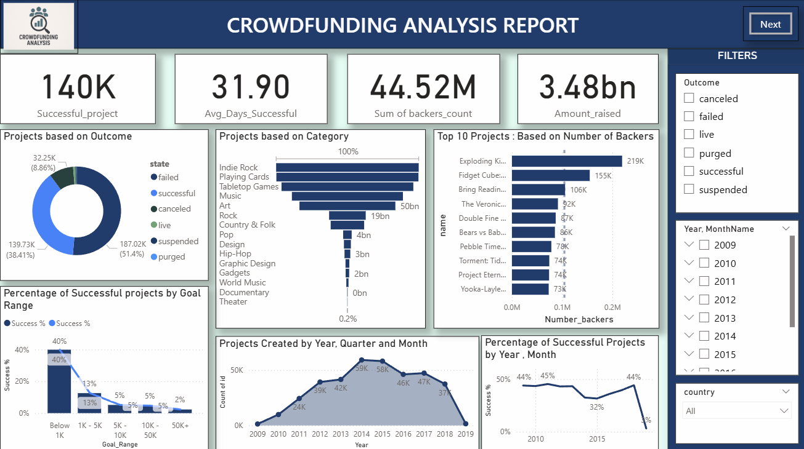
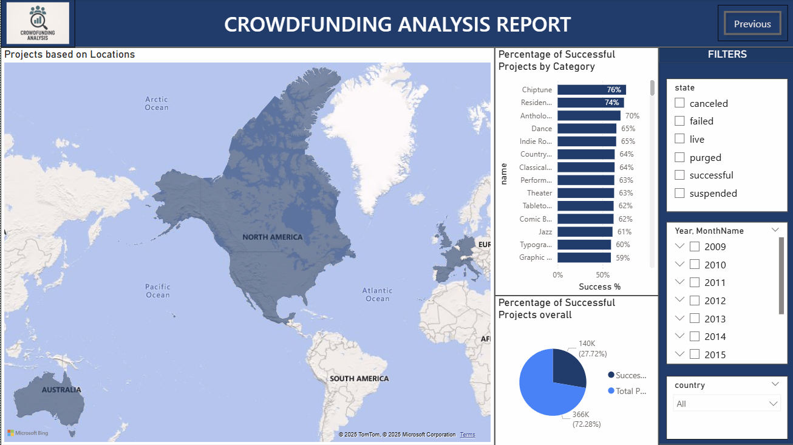

# 💰 Crowdfunding Data Analysis Project

## 📊 Project Overview
This project analyzes **Crowdfunding campaign data** to understand which factors contribute to successful projects.  
The insights are visualized through **Power BI dashboards**, showing outcomes, category trends, geographical insights, and backer statistics.

---

## 🎯 Objectives
- To identify patterns and trends in crowdfunding campaigns.  
- To determine which **categories** and **goal ranges** have the highest success rates.  
- To analyze the **geographical distribution** of successful campaigns.  
- To visualize **key performance metrics** like total backers and funds raised.

---

## 🧠 Key Insights
- **51%** of projects were **successful** among all campaigns.  
- **North America** had the highest number of successful projects.  
- **Projects with goal range below $1K** showed the highest success rate (~40%).  
- Top-performing categories include:
  - Indie Rock  
  - Tabletop Games  
  - Playing Cards  
- Campaign activity peaked during **2013–2015**, showing strong growth in that period.

---

## 🧰 Tools & Technologies Used
- **Power BI** – Data visualization and dashboard creation  
- **Excel / CSV Files** – Dataset handling  
- **Data Cleaning** – Filtering and formatting raw data for visualization  

---

## 📈 Dashboard Highlights

### 🔹 **Page 1 – Campaign Summary**

**Includes:**
- Key Metrics (Successful Projects, Avg. Days, Total Backers, Amount Raised)  
- Donut Chart of Project Outcomes  
- Category-wise and Goal-range Analysis  
- Top 10 Projects by Number of Backers  
- Trend of Projects by Year and Month  

---

### 🔹 **Page 2 – Geographical Insights**

**Includes:**
- Map showing project distribution by location  
- Success Percentage by Category  
- Overall Success Percentage Comparison  

---

## 🗂️ Dataset Information
The dataset contains details of crowdfunding campaigns such as:
- Project name, category, goal, and pledged amount  
- State (successful, failed
